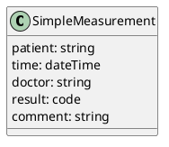

# Model options

## Narrative

- SimpleMeasurement
  - Patient     | mandatory   | text | The patient identifier expected     
  - Time        | mandatory   | timestamp
  - Doctor      | optional    | text | The doctor identifier expected
  - Result      | mandatory   | code | SNOMED code expected
  - Comment     | optional    | text    


## Graphical editor and embedded viewer

{{def:SimpleMeasurement}}

## FSH
```
Logical: SimpleMeasurement
Parent: Element
Id: SimpleMeasurement
* ^url = "https://kodality.org/StructureDefinition/SimpleMeasurement"
* patient 1..1 string "Patient identifier" "Subject of procedure."
* time 1..1 dateTime "Effective time" "When the observation was measured."
* doctor 0..1 string "Practitioner identifier" "Practitioner performed observation"
* result 1..1 code "The actual SNOMED code as observation result." 
* comment 0..1 string "Comments about the observation" 
``` 

## UML Class Diagramm


## StructureDefinition JSON
```json
{
  "resourceType": "StructureDefinition",
  "id": "SimpleMeasurement",
  "url": "https://kodality.org/StructureDefinition/SimpleMeasurement",
  "name": "SimpleMeasurement",
  "status": "active",
  "fhirVersion": "4.0.1",
  "mapping": [
    {
      "identity": "rim",
      "uri": "http://hl7.org/v3",
      "name": "RIM Mapping"
    }
  ],
  "kind": "logical",
  "abstract": false,
  "type": "https://kodality.org/StructureDefinition/SimpleMeasurement",
  "baseDefinition": "http://hl7.org/fhir/StructureDefinition/Element",
  "derivation": "specialization",
  "differential": {
    "element": [
      {
        "id": "SimpleMeasurement",
        "path": "SimpleMeasurement"
      },
      {
        "definition": "Subject of procedure.",
        "id": "SimpleMeasurement.patient",
        "max": "1",
        "min": 1,
        "path": "SimpleMeasurement.patient",
        "short": "Patient identifier",
        "type": [
          {
            "code": "string"
          }
        ]
      },
      {
        "definition": "When the observation was measured.",
        "id": "SimpleMeasurement.time",
        "max": "1",
        "min": 1,
        "path": "SimpleMeasurement.time",
        "short": "Effective time",
        "type": [
          {
            "code": "dateTime"
          }
        ]
      },
      {
        "definition": "Practitioner requested information",
        "id": "SimpleMeasurement.doctor",
        "max": "1",
        "min": 0,
        "path": "SimpleMeasurement.doctor",
        "short": "Practitioner identifier",
        "type": [
          {
            "code": "string"
          }
        ]
      },
      {
        "definition": "The actual coded result of observation.",
        "id": "SimpleMeasurement.result",
        "max": "1",
        "min": 1,
        "path": "SimpleMeasurement.result",
        "short": "The actual SNOMED code as observation result.",
        "type": [
          {
            "code": "code"
          }
        ]
      },
      {
        "definition": "Comments about the observation or the results.",
        "id": "SimpleMeasurement.comment",
        "max": "1",
        "min": 0,
        "path": "SimpleMeasurement.comment",
        "short": "Comments about the observation",
        "type": [
          {
            "code": "string"
          }
        ]
      }
    ]
  }
}
``` 